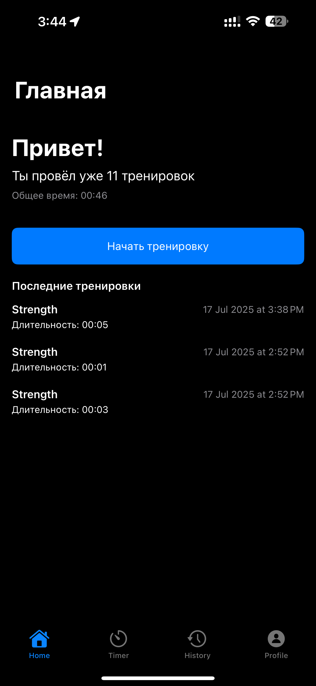
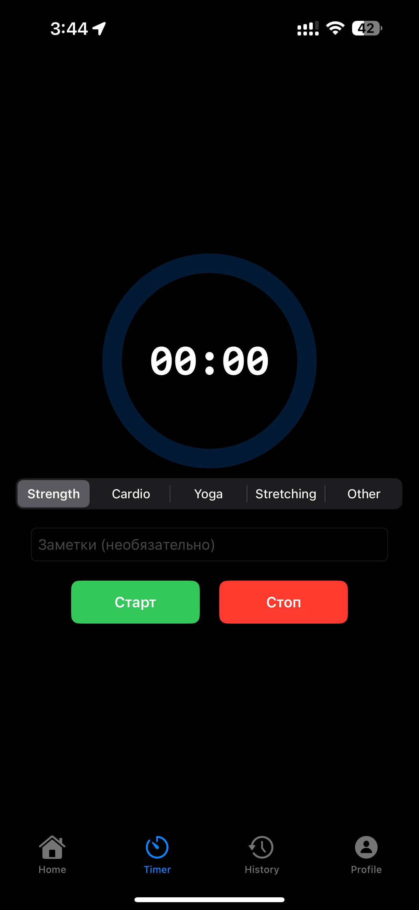
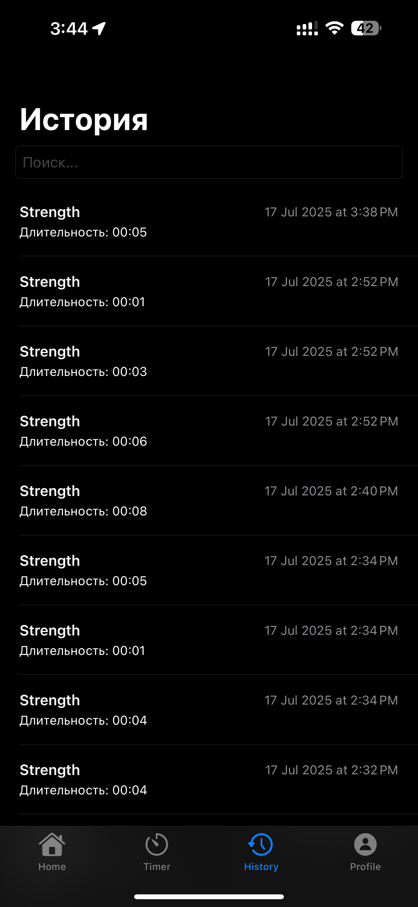
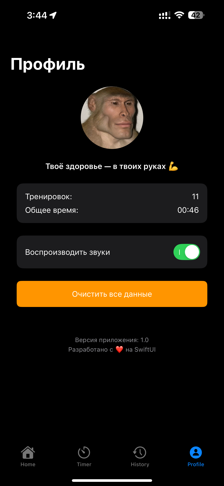

# 🏋️ SportTimer

Простое и удобное iOS-приложение для отслеживания тренировок с таймером, историей и статистикой.

---

## 📲 Скриншоты

| Главный экран | Таймер | История | Профиль | Пример работы |
|---------------|--------|---------|---------|---------------|
|  |  |  |  |  |

---

---

## 🛠 Архитектура и технологии

**Архитектурный паттерн:** `MVVM`  
**Язык:** Swift 5.9+  
**UI:** SwiftUI  
**Хранение данных:** Core Data  
**Многопоточность:** async/await  
**Минимальная версия iOS:** 16.0  

### 🔍 Структура

- `Views/` — пользовательский интерфейс
- `ViewModels/` — логика представления и состояния
- `Models/` — Core Data модели и бизнес-логика
- `Assets/` — изображения и цвета
- `PersistenceController.swift` — управление Core Data стеком

---

## 🚀 Инструкция по запуску

1. Склонируйте репозиторий:
   ```bash
   git clone https://github.com/vanyushais/Sport-Timer.git
